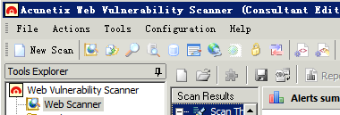
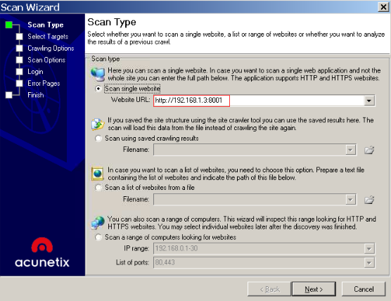
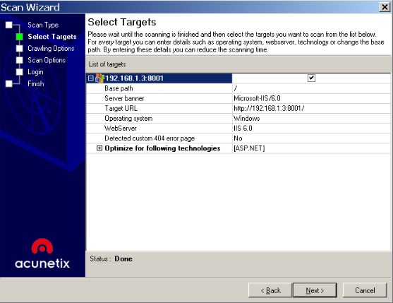
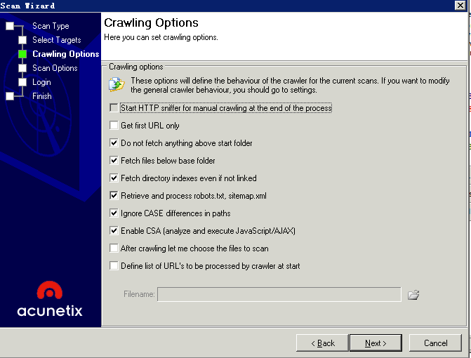
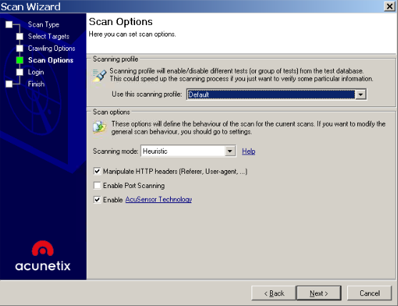
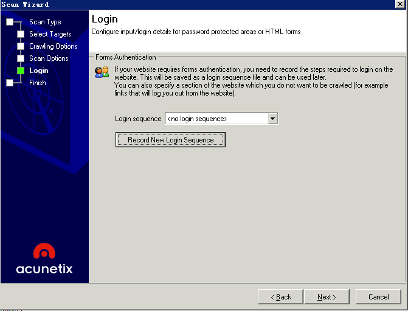
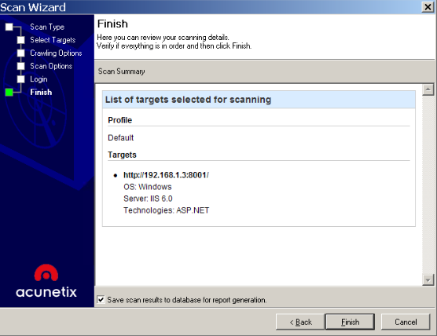
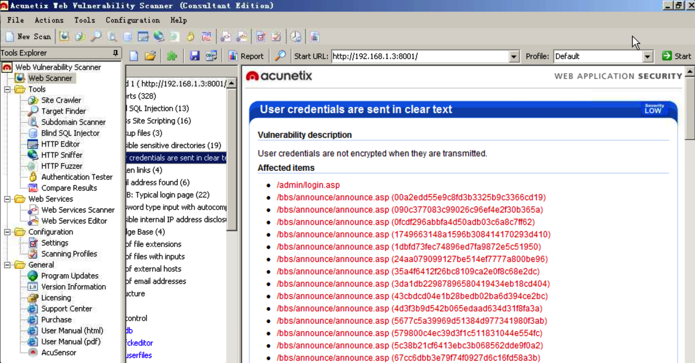
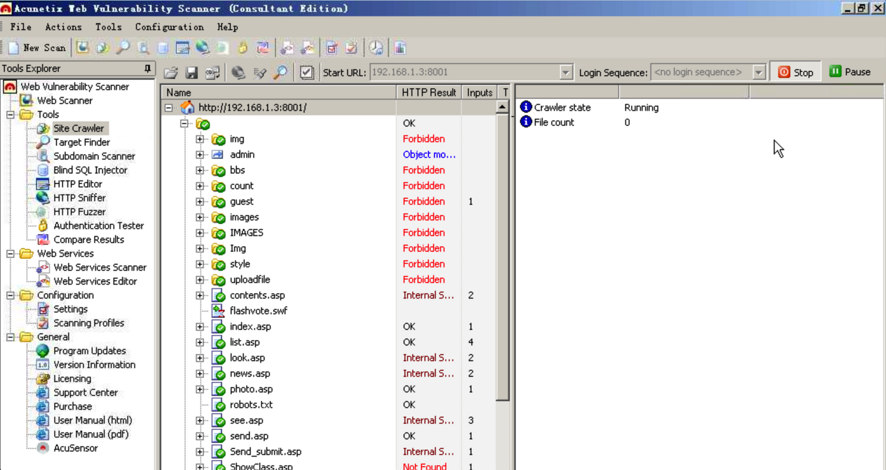
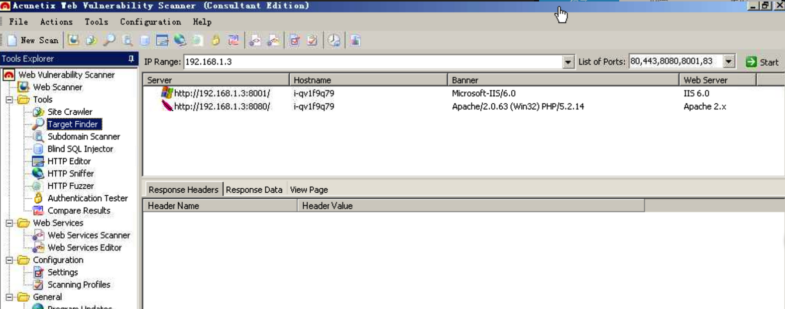

# awvs扫描器扫描web漏洞 #

链接：[http://www.shiyanbar.com/experiment-course/experiment-course/vid/2058](http://www.shiyanbar.com/experiment-course/experiment-course/vid/2058)

**目的：**

1. 了解AWVS-Web漏洞扫描工具
2. 学习AWVS的用法

**介绍：**

AWVS（Acunetix Web Vulnerability Scanner）简介WVS(Web Vulnerability Scanner)是一个自动化的Web应用程序安全测试工具，它可以扫描任何可通过Web浏览器访问的和遵循HTTP/HTTPS规则的Web站点和Web应用程序。适用于任何中小型和大型企业和其它人员的Web网站。WVS可以通过检查SQL注入攻击漏洞、跨站脚本攻击漏洞等来审核Web应用程序的安全性。 它可以扫描任何可通过Web浏览器访问的和遵循HTTP/HTTPS规则的Web站点和Web应用程序。

**AWVS功能介绍**

WebScanner，核心功能，Web安全漏洞扫描

	 Site Crawler，爬虫功能，遍历站点目录结构
	 Target Finder，端口扫描，找出web服务器，80,443
	 Subdomain Scanner，子域名扫描器，利用DNS查询
	 Blind SQL Injector，盲注工具
	 HTTP Editor，http协议数据包编辑器
	 HTTP Sniffer，HTTP协议嗅探器
	 HTTP Fuzzer，模糊测试工具
	 Authentication Tester，Web认证破解工具

**案例：**

	操作机：192.168.1.2  
	目标机：192.168.1.3

**步骤：**

#### 一、AWVS基本用法 ####

1.1 打开acunetix web Vulnerability Scanner 工具，点击“New Scan” 按钮，打开站点扫描导向如下图所示：

1.2 输入站点域名或IP，如url为http://192.168.0.3:8001，如下图所示：

1.3 点击 “下一步”，软件自动识别目标站点信息，也可以手动修改。如下图所示：

1.4 点击 “下一步”，进入 “Crawling Options”，默认即可，如下图所示：

1.5 点击 “下一步” ，选择扫描模板，一般选择 “Default” 即可。如下图所示：

1.6 点击 “下一步” ，如果网站需要登录，就在此处添加登录信息，但是本实例，不需要登录。如下图所示：

1.7 点击 “下一步”, 再次进行信息确认，无误点击“finish”即可开始扫描。如下图所示：

1.8 经过一段 一段时间得到扫描结果：如下图所示：

#### 二、AWVS高级功能演示 ####

2.1 site Crawler，爬虫功能，遍历站点目录结构，点击"tools"中的“Site Crawler” 选项，点击 “Start”，即可进行站点爬行。如下图所示：

2.2 Target Finder，端口扫描，找出web服务器，8001，,8080，如下图所示：

